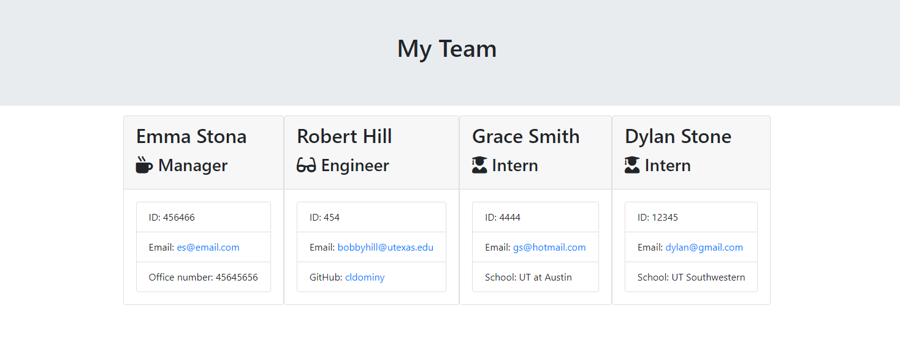

# Template Engine Application

This template engine was built using Object Oriented Programing so that a user an endlesssly add employees onto a team array with minimal, reusable coding. Node.js and inquirer help users create a team roaster through the terminal, asking specific questions based on the employee's role. Once finished, the html document is rendered and created through the output. Future considerations for this project is to limit the amount of managers, verify what the user inputted, and changing the CSS for the html page. 

# Demostration of Generator 

 
[Link to the Video](https://youtu.be/QeExZRTwNcU)

# Installation Instructions

[Node.js](https://nodejs.org/en/) must be downloaded first before using this generator. Once downloaded, create a pull request and open the program in VS code. Open the index.js in the integrated terminal of VS code and run "npm i" to download all npms used. To begin the program, run "node ./app.js" and answer all prompts to create your employee HTML page.
